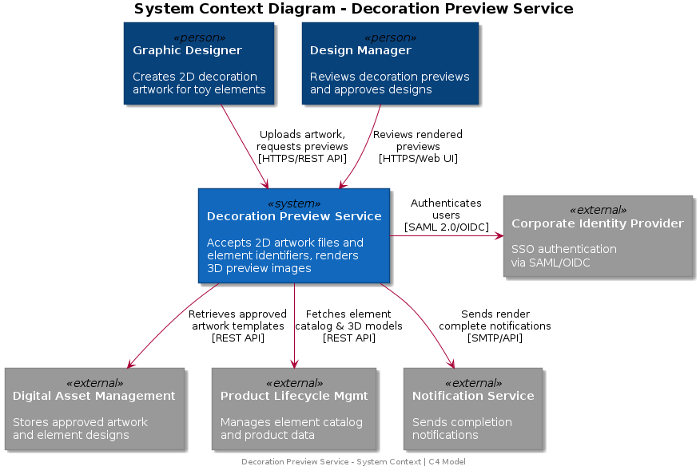
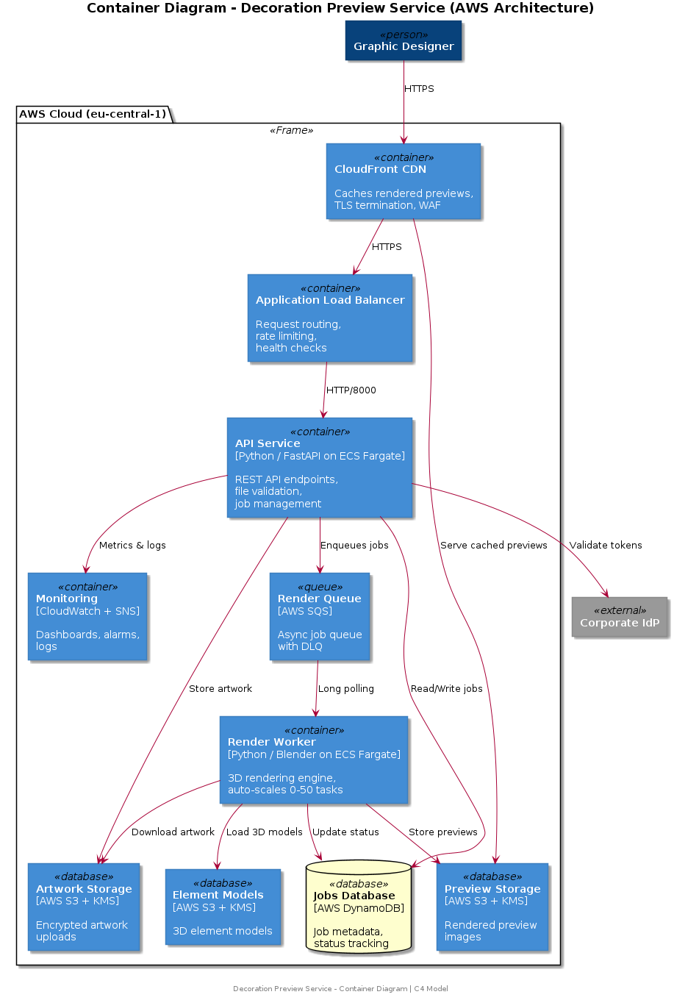

# Architecture Documentation

## Overview

The Decoration Preview Service is a cloud-native, event-driven system designed to transform 2D artwork files into 3D preview renderings applied to toy element models. The architecture prioritizes **security** (handling pre-release artwork), **scalability** (supporting growing design teams), and **reliability** (ensuring consistent preview quality).

## System Context (C4 Level 1)



The service sits within a broader ecosystem:

- **Graphic Designers** — Primary users who upload artwork and review previews
- **Design Managers** — Review and approve decoration designs
- **Digital Asset Management** — Source of approved artwork templates
- **Product Lifecycle Management** — Source of element catalog and 3D models
- **Corporate Identity Provider** — SSO authentication
- **Notification Service** — Render completion notifications

## Container Architecture (C4 Level 2)



### Core Components

#### 1. CloudFront CDN + WAF
- **Purpose**: Edge caching, TLS termination, DDoS protection
- **Behavior**: Caches rendered previews (1-hour TTL), passes API requests through
- **Security**: WAF rules block malicious requests, rate limiting per IP

#### 2. Application Load Balancer
- **Purpose**: Request routing, health checking, TLS offloading
- **Configuration**: Routes to ECS API service, HTTP→HTTPS redirect
- **Health Check**: `/health` endpoint every 30 seconds

#### 3. API Service (FastAPI on ECS Fargate)
- **Purpose**: REST API handling, request validation, job management
- **Scaling**: 2-10 tasks based on CPU utilization (target: 70%)
- **Resources**: 512 CPU units, 1024 MB memory per task
- **Endpoints**:
  - `POST /api/v1/render` — Submit render job
  - `GET /api/v1/render/{job_id}/status` — Check status
  - `GET /api/v1/render/{job_id}/preview` — Get preview URL
  - `GET /api/v1/elements` — List available elements
  - `DELETE /api/v1/render/{job_id}` — Cancel/delete job

#### 4. SQS Render Queue
- **Purpose**: Decouples API from rendering, enables async processing
- **Configuration**: 10-minute visibility timeout, long polling (20s)
- **DLQ**: Failed messages (after 3 retries) go to dead letter queue
- **Encryption**: KMS-encrypted at rest

#### 5. Render Workers (ECS Fargate)
- **Purpose**: 3D rendering using Blender (stubbed with Pillow for demo)
- **Scaling**: 0-50 tasks based on queue depth and CPU utilization
- **Resources**: 2048 CPU units, 4096 MB memory (GPU in production)
- **Process**: Poll SQS → Download artwork → Render → Upload result → Update status

#### 6. DynamoDB Jobs Table
- **Purpose**: Job metadata and status tracking
- **Schema**: Partition key: `job_id`
- **Indexes**: GSI on `status+created_at`, GSI on `element_id+created_at`
- **Features**: TTL for automatic cleanup, point-in-time recovery

#### 7. S3 Storage Buckets
- **Artwork Bucket**: Encrypted uploads with versioning, 90-day Glacier transition
- **Elements Bucket**: 3D model storage, versioned
- **Renders Bucket**: Preview images, 30-day expiry lifecycle
- **Common**: KMS encryption, block all public access, enforce SSL

#### 8. CloudWatch Monitoring
- **Dashboards**: API CPU/memory, queue depth, render task count
- **Alarms**: High CPU (>85%), queue backlog (>100), DLQ messages (>0)
- **Logs**: Structured JSON logging, 30-day retention

## Request Flow

### Render Job Lifecycle

```
1. Designer uploads artwork via POST /api/v1/render
2. API validates file (type, size, integrity)
3. API validates element_id exists in catalog
4. Artwork stored in S3 (encrypted)
5. Job record created in DynamoDB (status: PENDING)
6. Message sent to SQS render queue
7. API returns 202 Accepted with job_id

--- Asynchronous Processing ---

8. Render worker picks up message from SQS
9. Worker updates job status to PROCESSING
10. Worker downloads artwork from S3
11. Worker loads 3D element model
12. Worker applies decoration and renders scene
13. Worker uploads preview image to S3
14. Worker updates job status to COMPLETED
15. (Optional) Webhook notification sent

--- Client Retrieval ---

16. Client polls GET /status until completed
17. Client calls GET /preview to get pre-signed URL
18. CloudFront serves cached preview image
```

## Data Model

### Job Record (DynamoDB)

| Attribute | Type | Description |
|-----------|------|-------------|
| `job_id` | String (PK) | Unique job identifier |
| `element_id` | String | Target element |
| `artwork_filename` | String | Original filename |
| `output_format` | String | png/jpeg/webp |
| `resolution_width` | Number | Output width |
| `resolution_height` | Number | Output height |
| `camera_angle` | String | Render camera angle |
| `status` | String | pending/processing/completed/failed/cancelled |
| `progress_percent` | Number | 0-100 |
| `created_at` | String (ISO) | Creation timestamp |
| `updated_at` | String (ISO) | Last update |
| `preview_path` | String | S3 key for preview |
| `error_message` | String | Error details (if failed) |
| `ttl` | Number | TTL epoch for auto-cleanup |

## Technology Decisions

Key architecture decisions are documented as [Architecture Decision Records (ADRs)](adr/).

## Future Considerations

1. **GPU-accelerated rendering** — Move to GPU-enabled EC2 instances for production Blender rendering
2. **Redis caching** — ElastiCache for frequently-requested previews
3. **Multi-region** — CloudFront already provides edge distribution; add active-active for resilience
4. **Batch rendering** — Support bulk submissions for entire decoration sets
5. **Real-time preview** — WebSocket API for interactive decoration placement
